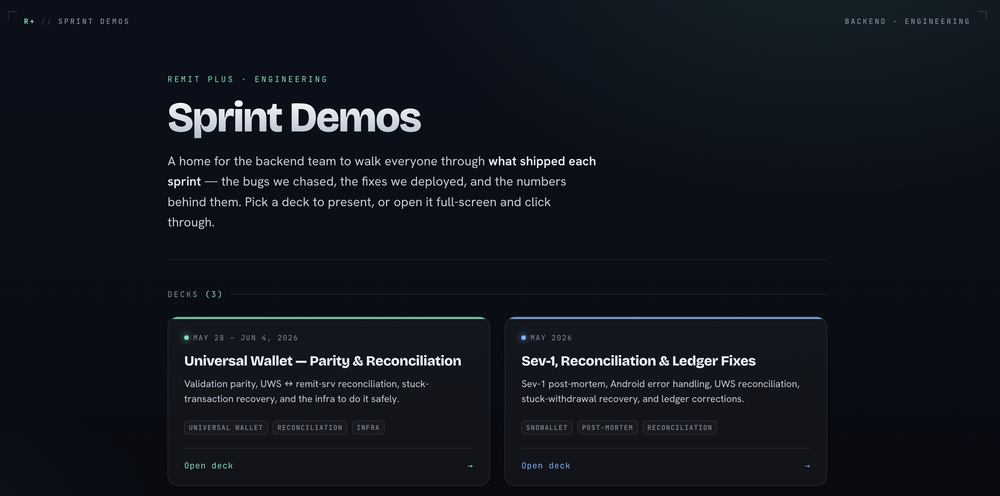

# Backend Sprint Demos

A small static site for the backend team to demo what shipped each sprint.
Each sprint is a self-contained [reveal.js](https://revealjs.com) deck; the
home page (`index.html`) links to all of them.



## The fast path

Open this repo in [Claude Code](https://claude.com/claude-code) and ask it to
build your deck from Jira (replace `your.username` with your Jira username):

> Create a sprint deck for everything `your.username` closed in the current
> sprint — pull my RPX tickets, group them into themes, and add the deck to my
> local `decks/decks.js` so it shows on the hub.

Claude reads the tickets (and your merged PRs if you ask), drafts the slides
using the shared styles, and registers the deck for you. See
[CLAUDE.md](CLAUDE.md) for more prompts.

[reveal.js](https://github.com/hakimel/reveal.js) is vendored as a **git
submodule** (`reveal.js/`, pinned to v6.0.1) rather than copied in, so this
repo only holds our own content — the hub and the decks.

## Clone

The submodule must be fetched too, so clone recursively:

```bash
git clone --recursive git@github.com:SeaAdic/backend-deck.git
```

Already cloned without `--recursive`? Pull the submodule in:

```bash
git submodule update --init --recursive
```

## Run

The decks use reveal.js's pre-built `dist/` (committed in the submodule), so
there's **no build step** — any static file server works:

```bash
python3 -m http.server 8000      # or:  npx serve -l 8000
```

Then open <http://localhost:8000> for the hub, or a deck directly at
`http://localhost:8000/decks/<sprint-slug>/`.

## Layout

```
backend-deck/
├── index.html              ← the hub (links to every deck)
├── reveal.js/              ← git submodule (the framework, pinned)
└── decks/
    ├── _shared/deck.css    ← shared design system
    ├── _template/          ← copy this to start a new deck
    └── <sprint-slug>/      ← one folder per sprint demo
        ├── index.html
        └── images/
```

## Add a sprint deck

See **[decks/README.md](decks/README.md)** — short version:

```bash
cp -r decks/_template decks/sprint-YYYY-MM-DD
```

write your slides, drop screenshots in that deck's `images/`, then add an entry
to your local `decks/decks.js` (`cp decks/decks.example.js decks/decks.js` the
first time) so it shows on the hub.

> Decks and your `decks/decks.js` list are **gitignored** — sprint content
> stays local and never gets pushed. Only the hub, shared styles, template, and
> docs live in the repo.

## Updating reveal.js

```bash
cd reveal.js
git fetch && git checkout <tag-or-commit>     # e.g. a newer release
cd ..
git add reveal.js && git commit -m "Bump reveal.js to <version>"
```
